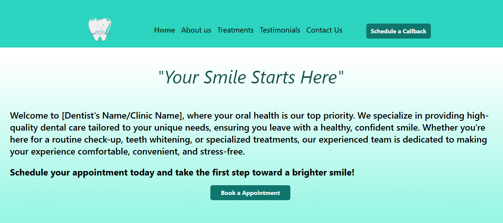

# Dentist Appointment Booking Website  



Welcome to the **Dentist Appointment Booking Website**! This is a user-friendly, responsive web application designed to help patients easily book appointments with a dentist without the hassle of logging in or signing up.  

---

## 😎 Live Demo

**Visit:** **https://dentist-appointment-booking-website-o5y7.vercel.app/**

---

## 🚀 Features  

- **Easy Appointment Booking**: No login required—book an appointment in just a few clicks.    
- **Interactive Calendar**: Seamlessly select dates and times for appointments.  
- **Service Information**: Explore a detailed list of dental services provided.  
- **Responsive Design**: Optimized for all devices, from desktops to mobile phones.  
- **Testimonials Section**: Real reviews from patients for building trust.  


---

## 🛠️ Tech Stack  

- React.js  
- Tailwind CSS  
- Material UI  


**Third-Party Integrations:**   
- Web3 Forms for Email Service .

---

## ⚙️ Installation 

**Follow these steps to set up the project locally:**

1. Clone this repository:
```bash
git clone https://github.com/rishi190104/Dentist-Appointment-Booking-Website.git 
```

2. Navigate to the project directory:
```bash
cd Dentist-Appointment-Booking-Website  
```

3. Install Dependencies:
```bash
npm install
```
4. Start the development server:
```bash
npm run dev
```

---

## 📬 Contact
For questions, feedback, or support, feel free to reach out:

**GitHub:** rishi190104
**Email:** rs9911777@gmail.com

